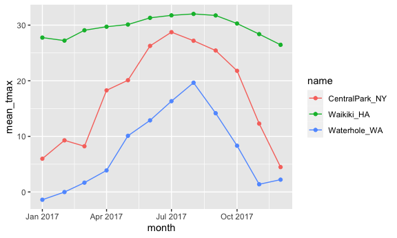
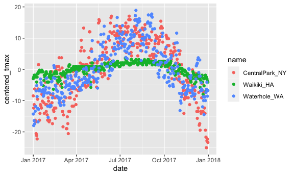

group by and summarize
================

``` r
library(tidyverse)
```

    ## ── Attaching packages ─────────────────────────────────────── tidyverse 1.3.1 ──

    ## ✓ ggplot2 3.3.5     ✓ purrr   0.3.4
    ## ✓ tibble  3.1.4     ✓ dplyr   1.0.7
    ## ✓ tidyr   1.1.3     ✓ stringr 1.4.0
    ## ✓ readr   2.0.1     ✓ forcats 0.5.1

    ## ── Conflicts ────────────────────────────────────────── tidyverse_conflicts() ──
    ## x dplyr::filter() masks stats::filter()
    ## x dplyr::lag()    masks stats::lag()

``` r
library(knitr)

knitr::opts_chunk$set(
  fig.width = 6, 
  fig.asp = .6, 
  out.width = "90%"
)
```

Load in a dataset that we’ll use often

``` r
weather_df =  
  rnoaa::meteo_pull_monitors(
    c("USW00094728", "USC00519397", "USS0023B17S"),
    var = c("PRCP", "TMIN", "TMAX"), 
    date_min = "2017-01-01",
    date_max = "2017-12-31") %>%
  mutate(
    name = recode(
      id, 
      USW00094728 = "CentralPark_NY", 
      USC00519397 = "Waikiki_HA",
      USS0023B17S = "Waterhole_WA"),
    tmin = tmin / 10,
    tmax = tmax / 10,
    month = lubridate::floor_date(date, unit = "month")) %>%
  select(name, id, everything())
```

    ## Registered S3 method overwritten by 'hoardr':
    ##   method           from
    ##   print.cache_info httr

    ## using cached file: ~/Library/Caches/R/noaa_ghcnd/USW00094728.dly

    ## date created (size, mb): 2021-10-05 10:31:07 (7.602)

    ## file min/max dates: 1869-01-01 / 2021-10-31

    ## using cached file: ~/Library/Caches/R/noaa_ghcnd/USC00519397.dly

    ## date created (size, mb): 2021-10-05 10:31:12 (1.697)

    ## file min/max dates: 1965-01-01 / 2020-02-29

    ## using cached file: ~/Library/Caches/R/noaa_ghcnd/USS0023B17S.dly

    ## date created (size, mb): 2021-10-05 10:31:14 (0.912)

    ## file min/max dates: 1999-09-01 / 2021-09-30

lubridate package creates a month variable - rounds date down to the
first day of the month

## `group_by`

``` r
weather_df %>% 
  group_by(name)
```

    ## # A tibble: 1,095 × 7
    ## # Groups:   name [3]
    ##    name           id          date        prcp  tmax  tmin month     
    ##    <chr>          <chr>       <date>     <dbl> <dbl> <dbl> <date>    
    ##  1 CentralPark_NY USW00094728 2017-01-01     0   8.9   4.4 2017-01-01
    ##  2 CentralPark_NY USW00094728 2017-01-02    53   5     2.8 2017-01-01
    ##  3 CentralPark_NY USW00094728 2017-01-03   147   6.1   3.9 2017-01-01
    ##  4 CentralPark_NY USW00094728 2017-01-04     0  11.1   1.1 2017-01-01
    ##  5 CentralPark_NY USW00094728 2017-01-05     0   1.1  -2.7 2017-01-01
    ##  6 CentralPark_NY USW00094728 2017-01-06    13   0.6  -3.8 2017-01-01
    ##  7 CentralPark_NY USW00094728 2017-01-07    81  -3.2  -6.6 2017-01-01
    ##  8 CentralPark_NY USW00094728 2017-01-08     0  -3.8  -8.8 2017-01-01
    ##  9 CentralPark_NY USW00094728 2017-01-09     0  -4.9  -9.9 2017-01-01
    ## 10 CentralPark_NY USW00094728 2017-01-10     0   7.8  -6   2017-01-01
    ## # … with 1,085 more rows

``` r
weather_df %>% 
  group_by(name, month)
```

    ## # A tibble: 1,095 × 7
    ## # Groups:   name, month [36]
    ##    name           id          date        prcp  tmax  tmin month     
    ##    <chr>          <chr>       <date>     <dbl> <dbl> <dbl> <date>    
    ##  1 CentralPark_NY USW00094728 2017-01-01     0   8.9   4.4 2017-01-01
    ##  2 CentralPark_NY USW00094728 2017-01-02    53   5     2.8 2017-01-01
    ##  3 CentralPark_NY USW00094728 2017-01-03   147   6.1   3.9 2017-01-01
    ##  4 CentralPark_NY USW00094728 2017-01-04     0  11.1   1.1 2017-01-01
    ##  5 CentralPark_NY USW00094728 2017-01-05     0   1.1  -2.7 2017-01-01
    ##  6 CentralPark_NY USW00094728 2017-01-06    13   0.6  -3.8 2017-01-01
    ##  7 CentralPark_NY USW00094728 2017-01-07    81  -3.2  -6.6 2017-01-01
    ##  8 CentralPark_NY USW00094728 2017-01-08     0  -3.8  -8.8 2017-01-01
    ##  9 CentralPark_NY USW00094728 2017-01-09     0  -4.9  -9.9 2017-01-01
    ## 10 CentralPark_NY USW00094728 2017-01-10     0   7.8  -6   2017-01-01
    ## # … with 1,085 more rows

Lists the number of groups I have at the top (nothing much else changes)

## count some things

``` r
weather_df %>% 
  group_by(month) %>% 
  summarize(n_obs = n())
```

    ## # A tibble: 12 × 2
    ##    month      n_obs
    ##    <date>     <int>
    ##  1 2017-01-01    93
    ##  2 2017-02-01    84
    ##  3 2017-03-01    93
    ##  4 2017-04-01    90
    ##  5 2017-05-01    93
    ##  6 2017-06-01    90
    ##  7 2017-07-01    93
    ##  8 2017-08-01    93
    ##  9 2017-09-01    90
    ## 10 2017-10-01    93
    ## 11 2017-11-01    90
    ## 12 2017-12-01    93

``` r
weather_df %>% 
  group_by(name, month) %>% 
  summarize(n_obs = n())
```

    ## `summarise()` has grouped output by 'name'. You can override using the `.groups` argument.

    ## # A tibble: 36 × 3
    ## # Groups:   name [3]
    ##    name           month      n_obs
    ##    <chr>          <date>     <int>
    ##  1 CentralPark_NY 2017-01-01    31
    ##  2 CentralPark_NY 2017-02-01    28
    ##  3 CentralPark_NY 2017-03-01    31
    ##  4 CentralPark_NY 2017-04-01    30
    ##  5 CentralPark_NY 2017-05-01    31
    ##  6 CentralPark_NY 2017-06-01    30
    ##  7 CentralPark_NY 2017-07-01    31
    ##  8 CentralPark_NY 2017-08-01    31
    ##  9 CentralPark_NY 2017-09-01    30
    ## 10 CentralPark_NY 2017-10-01    31
    ## # … with 26 more rows

Column for the group that I defined and then column two shows
observations

Then column for each part of the group and then n obs

It’s nice that summarize produces a data frame

`table` doesn’t and that’s bad (can’t plug this into ggplot)

``` r
weather_df %>% 
  pull(name) %>% 
  table()
```

    ## .
    ## CentralPark_NY     Waikiki_HA   Waterhole_WA 
    ##            365            365            365

``` r
weather_df %>% 
  janitor::tabyl(month, name)
```

    ##       month CentralPark_NY Waikiki_HA Waterhole_WA
    ##  2017-01-01             31         31           31
    ##  2017-02-01             28         28           28
    ##  2017-03-01             31         31           31
    ##  2017-04-01             30         30           30
    ##  2017-05-01             31         31           31
    ##  2017-06-01             30         30           30
    ##  2017-07-01             31         31           31
    ##  2017-08-01             31         31           31
    ##  2017-09-01             30         30           30
    ##  2017-10-01             31         31           31
    ##  2017-11-01             30         30           30
    ##  2017-12-01             31         31           31

This is the same information as group by then summarize, but the first
one is a data frame.

This is more human readable for NOW but the other option is more helpful
to then pipe into other things

## More general summaries

Let’s count, take means, look at SDs …

``` r
weather_df %>% 
  group_by(name) %>% 
  summarize(
    n_obs = n(), 
    mean_tmax = mean(tmax)
  )
```

    ## # A tibble: 3 × 3
    ##   name           n_obs mean_tmax
    ##   <chr>          <int>     <dbl>
    ## 1 CentralPark_NY   365     17.4 
    ## 2 Waikiki_HA       365     NA   
    ## 3 Waterhole_WA     365      7.48

``` r
weather_df %>% 
  group_by(name) %>% 
  summarize(
    n_obs = n(), 
    mean_tmax = mean(tmax, na.rm = TRUE)
  )
```

    ## # A tibble: 3 × 3
    ##   name           n_obs mean_tmax
    ##   <chr>          <int>     <dbl>
    ## 1 CentralPark_NY   365     17.4 
    ## 2 Waikiki_HA       365     29.7 
    ## 3 Waterhole_WA     365      7.48

``` r
weather_df %>% 
  group_by(name) %>% 
  summarize(
    n_obs = n(), 
    mean_tmax = mean(tmax, na.rm = TRUE),
    median_tmax = median(tmax, na.rm = TRUE), 
    sd_tmax = sd(tmax, na.rm = TRUE)
  )
```

    ## # A tibble: 3 × 5
    ##   name           n_obs mean_tmax median_tmax sd_tmax
    ##   <chr>          <int>     <dbl>       <dbl>   <dbl>
    ## 1 CentralPark_NY   365     17.4         18.3    9.86
    ## 2 Waikiki_HA       365     29.7         30      2.15
    ## 3 Waterhole_WA     365      7.48         5.5    7.96

``` r
weather_df %>% 
  group_by(month, name) %>% 
  summarize(
    n_obs = n(), 
    mean_tmax = mean(tmax, na.rm = TRUE),
    median_tmax = median(tmax, na.rm = TRUE), 
    sd_tmax = sd(tmax, na.rm = TRUE)
  ) %>% 
  ggplot(aes(x = month, y = mean_tmax, color = name)) + 
  geom_point() + 
  geom_line()
```

    ## `summarise()` has grouped output by 'month'. You can override using the `.groups` argument.



``` r
weather_df %>% 
  group_by(name) %>% 
  summarize(
    n_obs = n(), 
    mean_tmax = mean(tmax, na.rm = TRUE)) %>% 
    knitr::kable(digits = 2)
```

| name            | n\_obs | mean\_tmax |
|:----------------|-------:|-----------:|
| CentralPark\_NY |    365 |      17.37 |
| Waikiki\_HA     |    365 |      29.66 |
| Waterhole\_WA   |    365 |       7.48 |

Waikiki - NA for tmax (because of a missing observation in the original
df)

## grouped `mutate`

``` r
weather_df %>% 
  mutate(
    mean_tmax = mean(tmax, na.rm = TRUE)
  )
```

    ## # A tibble: 1,095 × 8
    ##    name           id          date        prcp  tmax  tmin month      mean_tmax
    ##    <chr>          <chr>       <date>     <dbl> <dbl> <dbl> <date>         <dbl>
    ##  1 CentralPark_NY USW00094728 2017-01-01     0   8.9   4.4 2017-01-01      18.1
    ##  2 CentralPark_NY USW00094728 2017-01-02    53   5     2.8 2017-01-01      18.1
    ##  3 CentralPark_NY USW00094728 2017-01-03   147   6.1   3.9 2017-01-01      18.1
    ##  4 CentralPark_NY USW00094728 2017-01-04     0  11.1   1.1 2017-01-01      18.1
    ##  5 CentralPark_NY USW00094728 2017-01-05     0   1.1  -2.7 2017-01-01      18.1
    ##  6 CentralPark_NY USW00094728 2017-01-06    13   0.6  -3.8 2017-01-01      18.1
    ##  7 CentralPark_NY USW00094728 2017-01-07    81  -3.2  -6.6 2017-01-01      18.1
    ##  8 CentralPark_NY USW00094728 2017-01-08     0  -3.8  -8.8 2017-01-01      18.1
    ##  9 CentralPark_NY USW00094728 2017-01-09     0  -4.9  -9.9 2017-01-01      18.1
    ## 10 CentralPark_NY USW00094728 2017-01-10     0   7.8  -6   2017-01-01      18.1
    ## # … with 1,085 more rows

Added a column that calculates the mean of tmax across all observations

``` r
weather_df %>% 
  group_by(name) %>% 
  mutate(
    mean_tmax = mean(tmax, na.rm = TRUE)
  )
```

    ## # A tibble: 1,095 × 8
    ## # Groups:   name [3]
    ##    name           id          date        prcp  tmax  tmin month      mean_tmax
    ##    <chr>          <chr>       <date>     <dbl> <dbl> <dbl> <date>         <dbl>
    ##  1 CentralPark_NY USW00094728 2017-01-01     0   8.9   4.4 2017-01-01      17.4
    ##  2 CentralPark_NY USW00094728 2017-01-02    53   5     2.8 2017-01-01      17.4
    ##  3 CentralPark_NY USW00094728 2017-01-03   147   6.1   3.9 2017-01-01      17.4
    ##  4 CentralPark_NY USW00094728 2017-01-04     0  11.1   1.1 2017-01-01      17.4
    ##  5 CentralPark_NY USW00094728 2017-01-05     0   1.1  -2.7 2017-01-01      17.4
    ##  6 CentralPark_NY USW00094728 2017-01-06    13   0.6  -3.8 2017-01-01      17.4
    ##  7 CentralPark_NY USW00094728 2017-01-07    81  -3.2  -6.6 2017-01-01      17.4
    ##  8 CentralPark_NY USW00094728 2017-01-08     0  -3.8  -8.8 2017-01-01      17.4
    ##  9 CentralPark_NY USW00094728 2017-01-09     0  -4.9  -9.9 2017-01-01      17.4
    ## 10 CentralPark_NY USW00094728 2017-01-10     0   7.8  -6   2017-01-01      17.4
    ## # … with 1,085 more rows

group –&gt; mutate, adds column to dataframe that is very group-specific

``` r
weather_df %>% 
  group_by(name) %>% 
  mutate(
    mean_tmax = mean(tmax, na.rm = TRUE), 
    centered_tmax = tmax - mean_tmax
  )
```

    ## # A tibble: 1,095 × 9
    ## # Groups:   name [3]
    ##    name           id    date        prcp  tmax  tmin month      mean_tmax centered_tmax
    ##    <chr>          <chr> <date>     <dbl> <dbl> <dbl> <date>         <dbl>         <dbl>
    ##  1 CentralPark_NY USW0… 2017-01-01     0   8.9   4.4 2017-01-01      17.4         -8.47
    ##  2 CentralPark_NY USW0… 2017-01-02    53   5     2.8 2017-01-01      17.4        -12.4 
    ##  3 CentralPark_NY USW0… 2017-01-03   147   6.1   3.9 2017-01-01      17.4        -11.3 
    ##  4 CentralPark_NY USW0… 2017-01-04     0  11.1   1.1 2017-01-01      17.4         -6.27
    ##  5 CentralPark_NY USW0… 2017-01-05     0   1.1  -2.7 2017-01-01      17.4        -16.3 
    ##  6 CentralPark_NY USW0… 2017-01-06    13   0.6  -3.8 2017-01-01      17.4        -16.8 
    ##  7 CentralPark_NY USW0… 2017-01-07    81  -3.2  -6.6 2017-01-01      17.4        -20.6 
    ##  8 CentralPark_NY USW0… 2017-01-08     0  -3.8  -8.8 2017-01-01      17.4        -21.2 
    ##  9 CentralPark_NY USW0… 2017-01-09     0  -4.9  -9.9 2017-01-01      17.4        -22.3 
    ## 10 CentralPark_NY USW0… 2017-01-10     0   7.8  -6   2017-01-01      17.4         -9.57
    ## # … with 1,085 more rows

subtract group-specific mean from the intividual tmax

``` r
weather_df %>% 
  group_by(name) %>% 
  mutate(
    mean_tmax = mean(tmax, na.rm = TRUE), 
    centered_tmax = tmax - mean_tmax
  ) %>% 
  ggplot(aes(x = date, y = centered_tmax, color = name)) + 
  geom_point()
```

    ## Warning: Removed 3 rows containing missing values (geom_point).



``` r
weather_df %>% 
  group_by(name) %>% 
  mutate(
    tmax_rank = min_rank(tmax)
  )
```

    ## # A tibble: 1,095 × 8
    ## # Groups:   name [3]
    ##    name           id          date        prcp  tmax  tmin month      tmax_rank
    ##    <chr>          <chr>       <date>     <dbl> <dbl> <dbl> <date>         <int>
    ##  1 CentralPark_NY USW00094728 2017-01-01     0   8.9   4.4 2017-01-01        82
    ##  2 CentralPark_NY USW00094728 2017-01-02    53   5     2.8 2017-01-01        45
    ##  3 CentralPark_NY USW00094728 2017-01-03   147   6.1   3.9 2017-01-01        55
    ##  4 CentralPark_NY USW00094728 2017-01-04     0  11.1   1.1 2017-01-01       108
    ##  5 CentralPark_NY USW00094728 2017-01-05     0   1.1  -2.7 2017-01-01        21
    ##  6 CentralPark_NY USW00094728 2017-01-06    13   0.6  -3.8 2017-01-01        19
    ##  7 CentralPark_NY USW00094728 2017-01-07    81  -3.2  -6.6 2017-01-01         8
    ##  8 CentralPark_NY USW00094728 2017-01-08     0  -3.8  -8.8 2017-01-01         7
    ##  9 CentralPark_NY USW00094728 2017-01-09     0  -4.9  -9.9 2017-01-01         4
    ## 10 CentralPark_NY USW00094728 2017-01-10     0   7.8  -6   2017-01-01        69
    ## # … with 1,085 more rows

ranked coldest days in Central Park, in x name

``` r
weather_df %>% 
  group_by(name) %>% 
  mutate(
    tmax_rank = min_rank(tmax)
  ) %>% 
  filter(tmax_rank < 2)
```

    ## # A tibble: 3 × 8
    ## # Groups:   name [3]
    ##   name           id          date        prcp  tmax  tmin month      tmax_rank
    ##   <chr>          <chr>       <date>     <dbl> <dbl> <dbl> <date>         <int>
    ## 1 CentralPark_NY USW00094728 2017-12-28     0  -7.7 -11.6 2017-12-01         1
    ## 2 Waikiki_HA     USC00519397 2017-12-21    18  21.7  18.3 2017-12-01         1
    ## 3 Waterhole_WA   USS0023B17S 2017-01-02    25 -10.5 -12.4 2017-01-01         1

``` r
weather_df %>% 
  group_by(name) %>% 
  mutate(
    tmax_rank = min_rank(desc(tmax))
  ) %>% 
  filter(tmax_rank < 2)
```

    ## # A tibble: 4 × 8
    ## # Groups:   name [3]
    ##   name           id          date        prcp  tmax  tmin month      tmax_rank
    ##   <chr>          <chr>       <date>     <dbl> <dbl> <dbl> <date>         <int>
    ## 1 CentralPark_NY USW00094728 2017-06-13     0  34.4  25   2017-06-01         1
    ## 2 CentralPark_NY USW00094728 2017-07-20     3  34.4  25   2017-07-01         1
    ## 3 Waikiki_HA     USC00519397 2017-07-12     0  33.3  24.4 2017-07-01         1
    ## 4 Waterhole_WA   USS0023B17S 2017-08-03     0  26.4  13.3 2017-08-01         1

Variety of different ranking functions; deal with ties in different
ways, use min rank and if ties really matter you can see help files

Windowed functions depend on other things within the df (vs. just
absolute value)

Lagged variables (lagged effect of some exposure down the road)

``` r
weather_df %>% 
  group_by(name) %>% 
  mutate(
    lagged_tmax = lag(tmax, n=1)
  )
```

    ## # A tibble: 1,095 × 8
    ## # Groups:   name [3]
    ##    name           id          date        prcp  tmax  tmin month      lagged_tmax
    ##    <chr>          <chr>       <date>     <dbl> <dbl> <dbl> <date>           <dbl>
    ##  1 CentralPark_NY USW00094728 2017-01-01     0   8.9   4.4 2017-01-01        NA  
    ##  2 CentralPark_NY USW00094728 2017-01-02    53   5     2.8 2017-01-01         8.9
    ##  3 CentralPark_NY USW00094728 2017-01-03   147   6.1   3.9 2017-01-01         5  
    ##  4 CentralPark_NY USW00094728 2017-01-04     0  11.1   1.1 2017-01-01         6.1
    ##  5 CentralPark_NY USW00094728 2017-01-05     0   1.1  -2.7 2017-01-01        11.1
    ##  6 CentralPark_NY USW00094728 2017-01-06    13   0.6  -3.8 2017-01-01         1.1
    ##  7 CentralPark_NY USW00094728 2017-01-07    81  -3.2  -6.6 2017-01-01         0.6
    ##  8 CentralPark_NY USW00094728 2017-01-08     0  -3.8  -8.8 2017-01-01        -3.2
    ##  9 CentralPark_NY USW00094728 2017-01-09     0  -4.9  -9.9 2017-01-01        -3.8
    ## 10 CentralPark_NY USW00094728 2017-01-10     0   7.8  -6   2017-01-01        -4.9
    ## # … with 1,085 more rows

NA value \#1 because there are no dates before You need the grouping
structure in place or else the first day from Waikiki would pull from
lag temp max from Waterhole which is super inaccurate

``` r
weather_df %>% 
  group_by(name) %>% 
  mutate(
    lagged_tmax = lag(tmax, n=1), 
    tmax_diff = tmax - lagged_tmax) %>% 
  summarize(diff_sd = sd(tmax_diff, na.rm = TRUE))
```

    ## # A tibble: 3 × 2
    ##   name           diff_sd
    ##   <chr>            <dbl>
    ## 1 CentralPark_NY    4.45
    ## 2 Waikiki_HA        1.23
    ## 3 Waterhole_WA      3.13

Day-to-day fluctuations –&gt; 4 degrees in Central Park!

## Limitations

What if my “summary” is a linear model …

``` r
weather_df %>% 
  group_by(name) %>% 
  summarize(cor_tmin_tmax = cor(tmin, tmax, use = "complete"))
```

    ## # A tibble: 3 × 2
    ##   name           cor_tmin_tmax
    ##   <chr>                  <dbl>
    ## 1 CentralPark_NY         0.955
    ## 2 Waikiki_HA             0.638
    ## 3 Waterhole_WA           0.939

``` r
weather_df %>% 
  filter(name == "CentralPark_NY") %>% 
  lm(tmax ~ tmin, data = .)
```

    ## 
    ## Call:
    ## lm(formula = tmax ~ tmin, data = .)
    ## 
    ## Coefficients:
    ## (Intercept)         tmin  
    ##       7.209        1.039

This is not a single number summary - Group by and summarize work well
with single number summaries

lm = linear model

weather\_df %&gt;% group\_by(name) %&gt;% summarize(lm = lm(tmax \~
tmin)

THIS DOESN’T WORK
